# PLUTUS PIONEER PROGRAM

## Documentation Week 4

## Creator: [Kappos Angelos](https://www.linkedin.com/in/angelos-dionysios-kappos-4b668140/)

## Credits to: [Sapiopool Cardano Community](https://sapiopool.com/) 

## Contents

## Topics covered:
- Set up environment for week 4
- Side Effects
- IO - IO implementation
- Monads
  - Maybe && code
  - Either && code
  - Writer && code
  - Second implementation
  - Monad definition / bind function / Monad Benefits
- Plutus Monads
  - EmulatorTrace Monad
  - Contract Monad
- Homework
- Homework Solution

**Set up Week 4**:
```
cd cardano/plutus 
git pull
git checkout 2fbb7abb22138a434bb6c4f663a81e9b9dc51e98
-- here add the tag from cabal.project of each week exercise
-- this tag can be found in file cabal.project in week03 of plutus-pioneer-program repository--
```
Similar to the previous weeks-lectures, our next steps here are to build Plutus && start server/client: - Building phase will take a bit-
```
nix build -f default.nix plutus.haskell.packages.plutus-core 
nix-build -A plutus-playground.client 
nix-build -A plutus-playground.server 
nix-build -A plutus-playground.generate-purescript 
nix-build -A plutus-playground.start-backend 
nix-build -A plutus-pab 
nix-shell 
cd plutus-pab 
plutus-pab-generate-purs 
cd ../plutus-playground-server 
plutus-playground-generate-purs
```

Start Server
```
plutus-playground-server
```
new Terminal
```
cd cardano/plutus
nix-shell
cd plutus-playground-client
```
start Client (this may take a while)
```
npm run start
```
in Browser
```
https://localhost:8009/
```
new Terminal
```
cd cardano/plutus-pioneer-program
git fetch
cd ../plutus
nix-shell
cd  ../plutus-pioneer-program/code/week03/
cabal update  
cabal build
```

## Side effects
## IO Actions


In a new terminal and in folder  plutus-pioneer-program/code/week04 after you run cabal update/build (read README.md for more info) you can see the in REPL some ways to create IO actions:


In **REPL** follow the below commands:
```
Main > :t putStrLn "Hello World"            -- if it is IO is suitable for main program
Main >
Main > putStrLn "Hello, world"              -- A way to run an IO expression is in REPL
Main >  :t getLine
Main >  getLine
Main >  :i IO                               -- we here Functor type constructor you can turn an f(a) -> f(b)
Main >
Main > import Data.Char
Main > :t toUpper
Main > toUpper 'q'
Main > map toUpper "Haskell"
Main > :t map toUpper                       -- this map toUpper function is a function from string to string
Main >
Main > :t fmap (map toUpper) getLine        -- this is a way we get IO actions and turn them to Unit IO actions
Main > fmap (map toUpper) getLine           -- If we execute getLine in the REPL, it waits for keyboard input
Main > putStrLn "Hello" >> putStrLn "World" -- sequence operator
Main > :t (>>=) -- Binc operator
Main > getLine >>= putStrLn
                                            -- Here, the function getLine is of type IO String. The return value a is passed to the function (a -> m b) which then 
                                            -- generates a recipe putStrLn with an input value of a and an output of type IO (). 
                                            -- Then, putStrLn performs its side effects and returns Unit.
                                            ----- Below is another way to create IO function is with function return
Main > :t return
Main > return "Haskell" :: IO String
```
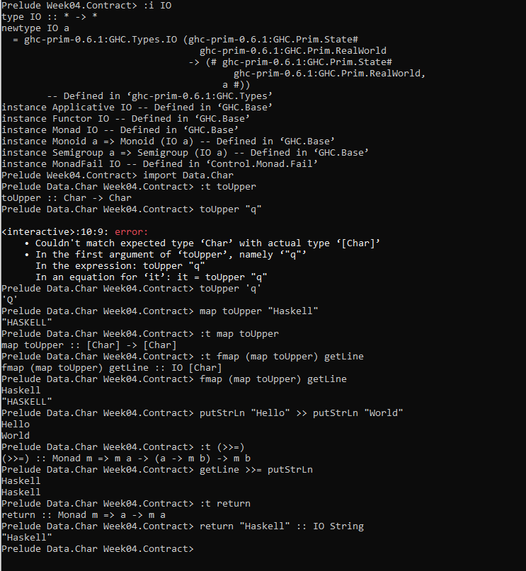

If we go back to app/hello.hs  -- we can run an IO action
```
~ /cardano/plutus-pionner-program/code/week04/app
cabal run hello 
```
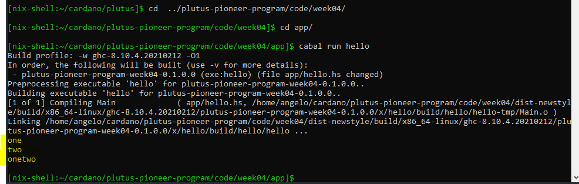

The IO monad can be used maybe later in the course. It can be used when we deploy plutus contract into testnet, but for the purpose of this course there is no more need.

Maybe type
It has two constructors - Nothing, which takes no arguments, and Just, which takes one argument.

```
data Maybe a = Nothing | Just a
```

Inside Maybe.hs file there are comments that explains the purpose of each function.
The main idea is that the function should try to parse all three Strings as Ints. If all the Strings can be successfully parsed as Ints, then we want to add those three Ints to get a sum. If one of the parses fails, we want to return Nothing. Inside the file we will see 3 different ways to this.

Again in REPL
```
Main >  import Week04.Maybe
Main >  :i Maybe
Main >  import Text.Read (readMaybe)
Main >  read "42" :: Int
Main >  read "42+u" :: Int           --  we get exception
Main > readMaybe "42" :: Maybe Int
Main > readMaybe "42+u" :: Maybe Int -- we get Nothing as a result
Main >
Main > foo "1" "2" "3"
Main > foo "" "2" "3"
Main > bindMaybe (readMaybe "42" :: Maybe Int) (\x -> bindMaybe (readMaybe "5" :: Maybe Int) (\y -> Just (y + x)))
```
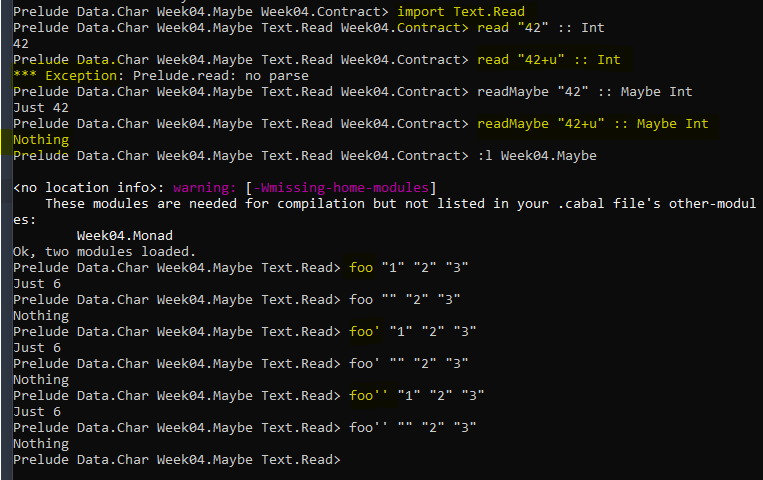

## **EITHER**
Either takes two parameters, a and b. Like Maybe it has two constructors, but unlike Maybe both take a value. It can Either be an a or a b. The two constructors are Left and Right. The logic inside this file is similar with the previous about Maybe.
```
Main > Left "Haskell" :: Either String Int
Main > Right 7 :: Either String Int
Main > readEither "42" :: Either String Int
Main > readEither "42+u" :: Either String Int
Main > foo "1" "2" "3"
Main > foo "xyz" "2" "3"
```

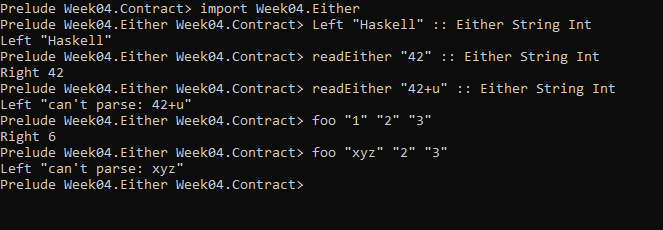

## **WRITER**

The Writer monad represents computations which produce a stream of data in addition to the computed values. It is commonly used by code generators to emit code.
The Writer monad is for values that have another value attached that acts as a sort of log value. Writer allows us to do computations while making sure that all the log values are combined into one log value, which then is attached to the result.
transformers provides both the strict and lazy versions of WriterT monad transformer. The definition of bind operator >>= reveals how the Writer monad works.
```
instance (Monoid w, Monad m) => Monad (WriterT w m) where 
return a = writer (a, mempty) 
m >>= k = WriterT $ do 
    (a, w) <- runWriterT m 
    (b, w') <- runWriterT (k a) 
    return (b, w `mappend` w')
```

runWriterT returns a pair whose second element is the output to accumulate. Because the output value is a Monoid instance, we can merge two outputs w and w' using mappend and return the combined output.
Here is a simple example of the Writer monad. It accumulates LogEntrys in a list. (CAUTION: Do not use WriterT for plain logging in real world applications. It unnecessarily keeps the entire logs in memory.

```
Main > import Week04.Writer
Main > Week04.Writer.foo (number 1) (number 2) (number 3)
Main > Week04.Writer.foo' (number 1) (number 2) (number 3)
Main > Week04.Writer.foo'' (number 1) (number 2) (number 3)
Main > 
Main >
```
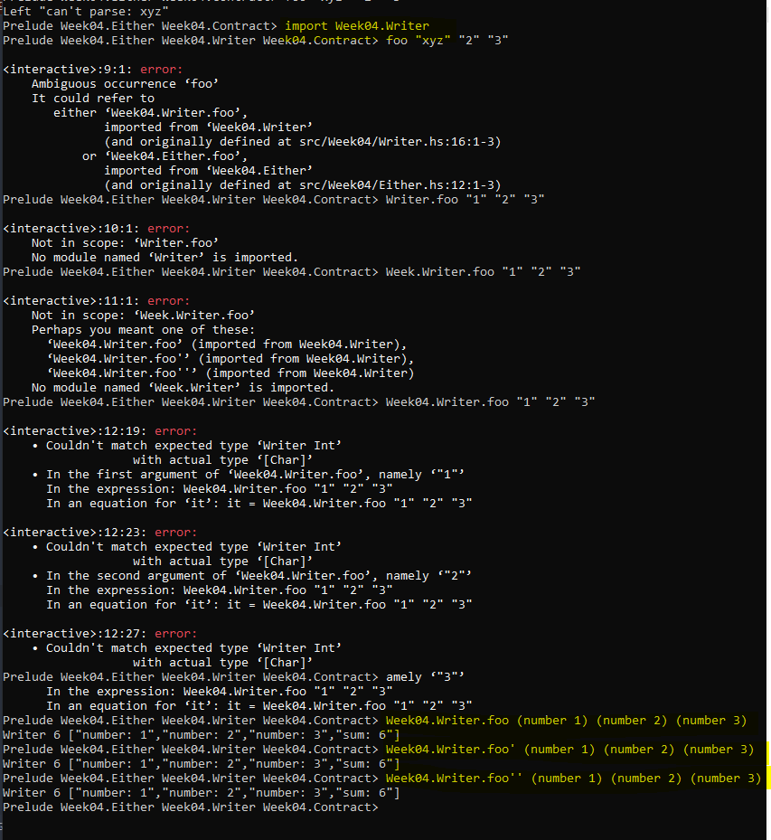

We no longer need to do the pattern matching to extract the messages. We don’t have to explicitly combine the log messages, where we could make a mistake and forget one, or get the order wrong. Instead, we abstract all that away and can just concentrate on the business logic.

Although the pattern is the same as with Maybe and Either, note that the special aspect of these computations is completely different. With Maybe and Either we dealt with the notion of failure, whereas here, with the Writer, there is no failure, but we instead have additional output.

## MONAD
## What is a monad?
For Haskell, it's a three-way partnership between:
- a type: M a
- an operator unit(M) :: a -> M a
- an operator bind(M) :: M a -> (a -> M b) -> M b // it throws away the result of the first computation, ignores a and take the fixed M b
  where unit(M) and bind(M) satisify the monad laws.

One way to think about a Monad is as a computation with a super power.

In the case of IO, the super power would be having real-world side-effects. In the case of Maybe, the super power is being able to fail. The super power of Either is to fail with an error message. And in the case of Writer, the super power is to log messages.

It's a sort of computation with side effect or a special feature or a super power. (Super power: log string messages, to fail with an error) and what makes it a monad is the existence of return and bind. So, return says you must have a way to give a pure value a, and you must be able to produce a computation of this with return value A that does not make use of this special feature, it's an IO function that hasn't any side effects and potentially failing computation that doesn't fail.
This would translate literally into Haskell as:
```
class Monad m where 
unit :: a -> m a 
bind :: m a -> (a -> m b) -> m b
```
For now, we'll just define unit and bind directly - no type classes.
So how does something so vague abstract help us with I/O? Because this abstraction allows us to hide the manipulation of all those fake values - the ones we've been using to maintain the correct sequence of evaluation. We just need a suitable type:
```
type IO' a = Int -> (a, Int)
```
and appropriate definitions for unit and bind:

```
unit :: a -> IO' a 
unit x = \i0 -> (x, i0) 
bind :: IO' a -> (a -> IO' b) -> IO' b 
bind m k = \i0 -> 
    let (x, i1) = m i0 in let (y, i2) = k x i1 
in 
    (y, i2)
```
The then operator
```
(>>) :: m a -> m b -> m b
```
Basically does the same as the bind operator, only it does not care about the output. (it "throws" it away).
Monad Banefits:
- Allows naming of common patterns. As Lars said "it's always useful to name things", and in this case our integer checking may be given a name. threeInts
-  We don't need all of our bindMaybe, bindEither and bindWriter names. We can always just use our return and bind (>>=)
- We can easily create functions to be "shared", they don't care about which Monad instance, it only cares about the Monad type. Which means same as for our 3 bind functions, we can use the new threeInts function, for all of them. -
-  We don't care if its a Maybe / Either or Writer type.

About do notation: is the best way to do a computation (more readable to whom who are used to other Programming Languages)
```
threeInts' :: Monad m => m Int -> m Int -> m Int -> m Int
threeInts' mx my mz = do
    k <- mx
    l <- my
    m <- mz
    let s = k + l + m
    return s
```

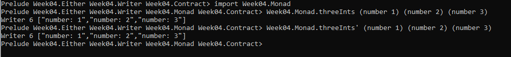


## PLUTUS MONADS

## The EmulatorTrace Monad
You may have wondered if there is a way to execute Plutus code for testing purposes without using the Plutus Playground. There is indeed, and this is done using the EmulatorTrace Monad.

You can think of a program in this monad as what we do manually in the simulator tab of the playground. That is, we define the initial conditions, we define the actions such as which wallets invoke which endpoints with which parameters and we define the waiting periods between actions.

The relevant definitions are in the package plutus-contract in module Plutus.Trace.Emulator.

```
Prelude Week04.Contract> import Plutus.Trace.Emulator
Prelude Week04.Contract> import Plutus.Contract.Trace
Prelude Week04.Contract> import Data.Default
Prelude Week04.Contract> :i EmulatorConfig
Prelude Week04.Contract> def :: EmulatorConfig
Prelude Week04.Contract> 
Prelude Week04.Contract> defaultDist                        -- we can each of the 10 wallets has been given an initial distribution of 100,000,000 lovelace.
Prelude Week04.Contract> defaultDist [Wallet 1]             -- get the balances for a specific wallet or wallets
Prelude Week04.Contract> :t runEmulatorTrace
Prelude Week04.Contract> import Wallet.Emulator.Stream
Prelude Week04.Contract> :i InitialChainState
Prelude Week04.Contract> :t Left defaultDist                -- we get the InitialDistribution
Prelude Week04.Contract> EmulatorConfig $ Left defaultDist  -- cnstruct an EmulatorConfig
Prelude Week04.Contract> runEmulatorTrace (EmulatorConfig $ Left defaultDist) $ return () -- crazy amount of Data here, so it needs a way to filter these data. --> So for this reason we use 
Prelude Week04.Contract> runEmulatorTraceIO $ return ()      
Prelude Week04.Contract>
```
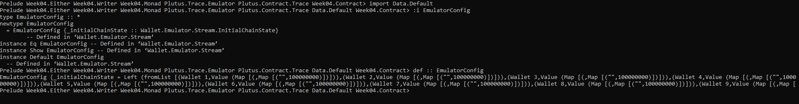

In an new terminal, again in **REPL** we follow the below logic:
```
Prelude Week04.Contract> :l src/Week04/Trace.hs
Prelude Week04.Contract> import Ledger.Fee
Prelude Week04.Contract> :i FeeConfig
Prelude Week04.Contract> def :: FeeConfig
Prelude Week04.Contract> import Plutus.Trace.Emulator
Prelude Week04.Contract> :i runEmulatorTrace
Prelude Week04.Contract> runEmulatorTrace def def $ return () -- we get a lot of outPut here, so we need to filter it if we want to see the info of the contract
Prelude Week04.Contract> :t runEmulatorTraceIO
Prelude Week04.Contract> runEmulatorTraceIO $ return ()
```
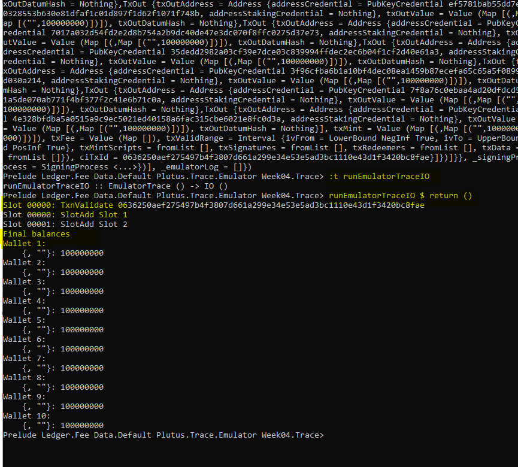

With the last command in REPL, we see a much more manageable, concise output. Nothing happens, but we see the Genesis transaction and then the final balances for each wallet.

## Testing Trace.hs
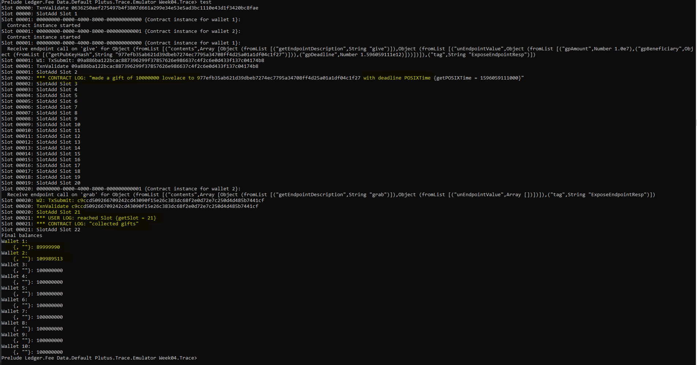
## Contract.hs
**Running test1:**


**testing test2**

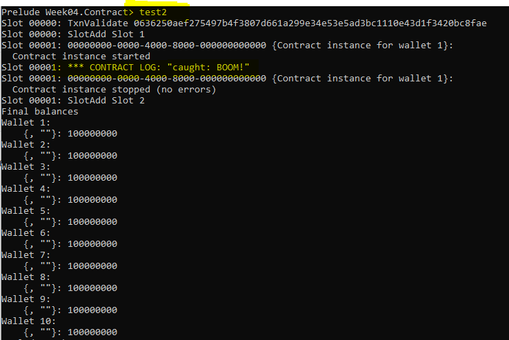

**testing test3**

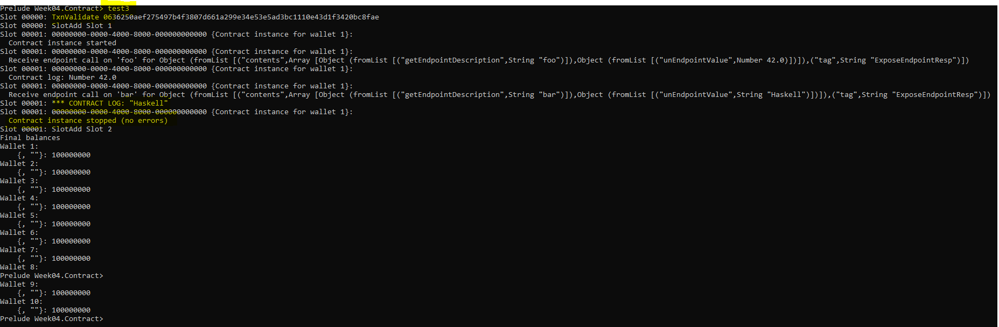

**testing test4**

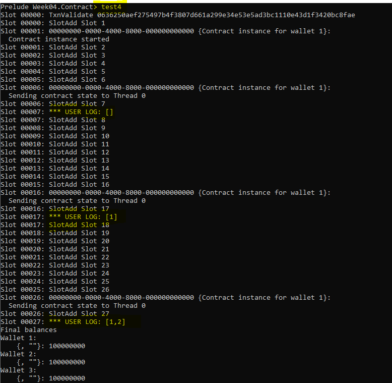

Using this mechanism, it is possible to pass information from the contract running in the wallet to the outside world. Using endpoints we can pass information into a contract. And using the tell mechanism we can get information out of the wallet.

## Homework - Solution Results

## payTest1
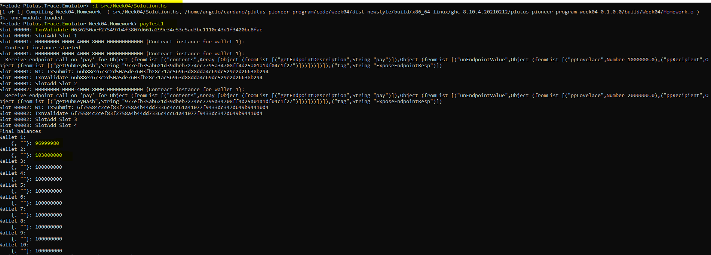

## payTest2
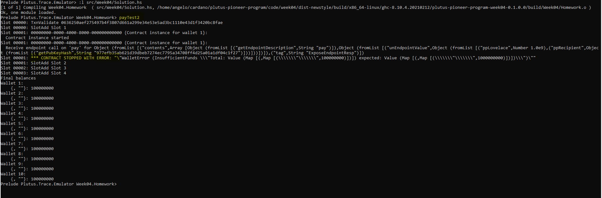

The **official lecture** can be found here [Lecture 4](https://www.youtube.com/watch?v=g4lvA14I-Jg&t=2422s&ab_channel=LarsBr%C3%BCnjes) of Lars Brünjes on YouTube.

The above documentation is created from Angelos Dionysios Kappos for personal use and in order to share it with Cardano community for educational purposes and everybody who is interested to learn the smart contracts of Cardano, and not to be sold.


## **Social Media Links Links/ More information:**

**Linkedin** :
[Kappos Angelos](https://www.linkedin.com/in/angelos-dionysios-kappos-4b668140/)

**Twitter accounts:**
- [angelokappos](https://twitter.com/angelokappos)
- [sapiopool](https://twitter.com/sapiopool)

**Who is SapioPool Cardano Community** : [Sapiopool Website](https://sapiopool.com/)


**Participate/collaborate in Sapiopool Greek Community *Discord* channel here** :
- [Discord Sapiopool](https://discord.com/invite/HRK9gGE9ax)

**Youtube:**
- [Sapiopool](https://www.youtube.com/channel/UCcPH2RMsszRGJ2awvLdMKzQ)
- [Marlowe](https://www.youtube.com/user/simonjohnthompson/videos)
- [Haskell](https://www.youtube.com/playlist?list=PLe7Ei6viL6jGp1Rfu0dil1JH1SHk9bgDV)