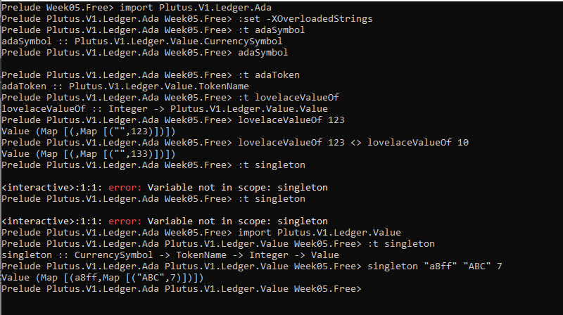
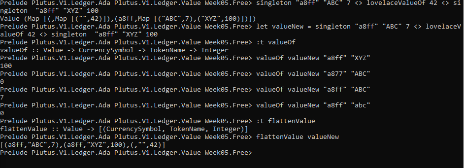

# PLUTUS PIONEER PROGRAM

## Documentation Week 5

## Creator: [Kappos Angelos](https://www.linkedin.com/in/angelos-dionysios-kappos-4b668140/)

## Credits to: [Sapiopool Cardano Community](https://sapiopool.com/)

## Contents

## Topics covered:
- Values & native tokens
- A simple minting policy
- A more realistic minting policy
- NFT's
- Cardano native tokens and NFT's and how to handle them in Plutus

```
cd cardano/plutus
git pull
git checkout 8a20664f00d8f396920385947903761a9a897fe0
-- use the tag from cabal.project from week 6
-- this tag can be found in file cabal.project in week06 of plutus-pioneer-program repository--
```
Don't forget at this time to change the cabal.project tag of Week05, like the way it is here in this repo.
```
tag: 8a20664f00d8f396920385947903761a9a897fe0
```
This way will save your time from errors. The same tag is used for week06 of second cohort.
Next steps Build Plutus && start server/client with the standard commands we have each week. You can find them in the README.md file all together.

## Values & Native tokens

Plutus supports native tokens and how to define under which conditions native tokens can be minted and burned. But before we get to that, let's explore what value means in Cardano.

When we talked about the (E)UTxO model, we learned that each UTxO (unspent transaction) has an address and a value. And, we saw that, as a result of being extended to the (E)UTxO model, each UTxO also has a Datum. We have seen examples of such UTxOs in previous lectures.

In the real Cardano blockchain, however, in the beginning there are only Ada, there are no other native tokens. So, you have to do something to create new native tokens, or to burn existing ones.

What does native token mean?
A token type accounting and tracking of which is natively supported by its underlying platform without a need for additional software.
----
every native token in Cardano including ADA is identified by two pieces of data, as you can see below:

1. CurrencySymbol :: ByteString
2. TokenName :: ByteString
Together, these two pieces of data form an AssetClass :: (CurrencySymbol, TokenName).

Therefore, a Value indicates how many units of each asset class are contained within itself, and looks like this:

```
Value (Map [(,Map [("", 42)]),(a8ff,Map [("ABC", 7),("XYZ", 100)])])
```
In the example above, the empty bytestrings represent the Lovelace CurrencySymbol and TokenName, respectively.
The a8ff bytestring represents the CurrencySymbol of some made up currency, while ABC and XYZ represent the TokenName of two made up tokens.
Importantly, a CurrencySymbol must always be represented as a hexadecimal because of how tokens are minted, i.e. they represent the hash of a script or "minting policy," discussed in the next section.
Here are some helpful utility functions related to Value:

```
-- Returns the CurrencySymbol of the ADA AssetClass
adaSymbol :: CurrencySymbol

-- Returns the ADA TokenName
adaToken :: TokenName

-- Returns the lovelace Value of a supplied Integer
lovelaceValueOf :: Integer -> Value

-- Constructs and returns a Value based on a CurrencySymbol, TokenName and amount
singleton :: CurrencySymbol -> TokenName -> Integer -> Value

-- Returns the Integer amount associated with a Value's CurrencySymbol and TokenName
-- 0 is returned if the TokenName is not found in Value
valueOf :: Value -> CurrencySymbol -> TokenName -> Integer

-- Returns a flat list of triples from the nested Value structure
flattenValue :: Value -> [(CurrencySymbol, TokenName, Integer)]
```

```
Prelude Week05.Free> import Plutus.V1.Ledger.Ada
Prelude Plutus.V1.Ledger.Ada Week05.Free> import Plutus.V1.Ledger.Value
Prelude Plutus.V1.Ledger.Ada Plutus.V1.Ledger.Value Week05.Free>
Prelude Plutus.V1.Ledger.Ada Plutus.V1.Ledger.Value Week05.Free> :set -XOverloadedStrings
```
- adaSymbol: This gives us the currency symbol of the Ada asset class, which is just the empty ByteString
- adaToken, which will give us the token name.

There is a function lovelaceValueOf  that, given an Integer, returns us a Value. So, for example to have 123 lovelace, we can do:
```
Prelude Plutus.V1.Ledger.Ada Plutus.V1.Ledger.Value Week05.Free> :t lovelaceValueOf
Prelude Plutus.V1.Ledger.Ada Plutus.V1.Ledger.Value Week05.Free> lovelaceValueOf 123
Value (Map [(,Map [("",123)])])
```
We can see our generated Value.
So, how do we create *Value*s containing native tokens? There is a very useful function called singleton.

```
Prelude Plutus.V1.Ledger.Ada Plutus.V1.Ledger.Value Week05.Free> :t singleton
singleton :: CurrencySymbol -> TokenName -> Integer -> Value
Week05.Free> singleton "a8ff" "ABC" 7
Value (Map [(a8ff,Map [("ABC",7)])])
```
The first argument, "a8ff" for CurrencySymbol" has to be a string representing a hexadecimal value. The
second argument, "ABC" for *TokenName can be an arbitrary string.




---
Combining Values:
The Value class is an instance of Monoid (check out week04 for a more in depth explanation). Because of this, we can use the mappend functionality that Monoids give us, to combine 2 (or more) Value's.
And, we can combine, as before, with the mappend operator. We can now create a somewhat more interesting map.
```
Week05.Free> singleton "a8ff" "ABC" 7 <> lovelaceValueOf 42 <> singleton "a8ff" "XYZ" 100
Value (Map [(,Map [("",42)]),(a8ff,Map [("ABC",7),("XYZ",100)])])
```
Now, we see a map representing 42 lovelace as well as two tokens ABC and XYZ both belonging to the CurrencySymbol "af88", and each with their respective integer amounts. Let's give this value a name:

```
Week05.Free> let v = singleton "a8ff" "ABC" 7 <> lovelaceValueOf 42 <> singleton "a8ff" "XYZ"
100
Week05.Free> v
Value (Map [(,Map [("",42)]),(a8ff,Map [("ABC",7),("XYZ",100)])])
```
- valueOf which allows us to get the value of a given currency symbol and token name.
- flattenValue As the name suggests, it flattens the map of maps into a flat list of triples

Because Value is an instance of Monoid, we can combine values like so:

```
lovelaceValueOf 123 <> lovelaceValueOf 10
```


##Minting Policies

Now the question is why?
- Why do we need both a currency symbol and a token name?
- Why don't we just use one identifier for an asset class?
- And why does the currency symbol have to be in hexadecimal digits?

###This is where so-called minting policies come in.

The rule is that, in general, a transaction can't create or delete tokens. Everything that goes in also comes out, with the exception of the fees.
- There is always a lovelace fee that has to be paid with each transaction.
- The fee depends on the size of the transaction and the number of steps that the validation script takes to execute, and the memory consumption of the script.

The reason that the currency symbol has to consist of hexadecimal digits is that it is actually the hash of a script. And this script is called the minting policy, and
- if we have a transaction where we want to create native or burn native tokens then, for each native token that we try to create or burn, the currency symbol is looked up.
- So, the corresponding script must also be contained in the transaction. And
- that script is executed along with the other validation scripts.

And, similar to the validation scripts that we have seen so that validate input, the purpose of these minting scripts is to decide whether this transaction has the right to mint or burn tokens. Ada also fits into this scheme.
!Remember that the currency symbol of Ada is just an empty string, which is not the hash of any scripts. So there is no script that hashes to the empty string, so there is no script that would allow the minting or burning of Ada, which means that Ada can never be minted or burned.

All the Ada that exists comes from the Genesis transaction and the total amount of Ada in the system is fixed and can never change. Only custom native tokens can have custom minting policies.

What is token redeeming?
Token redeeming is the action of sending tokens back to the issuer to be burned. This is usually done when the tokens being redeemed no longer have a purpose on the ledger, and the user or contract in possession of them is not able (not unauthorized by the minting policy) to burn the tokens.

What is a minting transaction?
transactions can carry data that specifies what tokens they are minting. The transactions where this piece of transaction data (called the mint field) is non-empty are called minting transactions. These transactions must also carry the minting policies for the tokens they are minting, so that they can be checked during validation.

The result of processing a minting transaction is that the ledger will now additionally contain the assets included in the mint field (minting field) of the transaction. If the quantity of a particular asset in the mint field is negative, the result is that after processing the transaction, the total quantity of that specific asset on the ledger will be reduced by the amount reflected in the mint field.

Note that a single transaction might mint tokens associated with multiple distinct minting policies. e.g., (Policy1, SomeTokens), (Policy2, SomeOtherTokens). Note also that a transaction might simultaneously mint some tokens and burn some other ones.

###What is a minting policy?

A. A minting policy is a set of rules used to regulate the minting of assets associated with it (scoped under it). For example, who has control (and under what conditions) over the supply of the currency, and its minting and burning.

This set of rules is defined by the user who wishes to create the new asset. For example, a user might wish to only allow themselves to ever mint this particular kind of token. In this case, they would stipulate this in the policy. Transaction data must satisfy all the minting policies of all assets the transaction is attempting to mint.


###A simple minting policy.


###An example - Free.hs

What is a single-issuer minting policy?

A. A single-issuer minting policy specifies that only the entity holding a particular set of keys is allowed to mint tokens under a particular policy. An example of a single-issuer policy use case could be tokens representing baseball cards. This would mean that no new baseball card tokens could be minted without the company's signatures. Conversely, the policy proves that all the existing cards scoped under this policy have been legitimately minted by the baseball card company.

Let's go to the REPL:
```
Prelude Week05.Free> :t curSymbol --
This completes the on-chain part, for this simple minting policy. But in order to try it out and
interact with it, we need an off-chain part.
Prelude Week05.Free> curSymbol
Prelude Week05.Free> test
```

###Testing with EmulatorTrace


Go to PLUTUS PLAYGROUND and Checking the above Minting Policy

-  Wallet 1 mints 555 ABC tokens, and
- Wallet 2 mints 444 ABC tokens. Then,
- after waiting for 1 slot,
- Wallet 1 burns 222 ABC tokens.
- Finally, we wait for 1 slot at the end.


With our monetary policy, we can create arbitrary forging and burning transactions by any wallet. So, this is probably NOT a very good monetary policy. The purpose of a token is to represent value, but if anybody at any time can mint new tokens, this token will not make much sense. Realistically this policy is rather useless.


##Example 2 - Signed.hs

###What is a one-time minting policy?

A. In a one-time minting policy, the complete set of tokens scoped under it is minted by one specific transaction. This means that no more tokens will ever be minted under that policy. A use case of a one-time minting policy would be minting ticket tokens for a specific gig. The venue capacity is known ahead of time, so there'll be no need to ever allow more tickets to be minted.

A realistic minting policy is one where the minting and burning of tokens is restricted to transactions that are signed by a specific public key hash. That is similar to a central bank, in fiat currencies.

In REPL:
```
Prelude Week05.Signed> :l src/Week05/Signed.hs
Prelude Week05.Signed> test
```


How validation works?
When we don't have a public key address, but a script address, and a UTxO that sits at that address, then for any transaction that tries to consume that UTxO, a validation script is run.
That validation script gets, as input, the datum, which comes from the UTxO, the redeemer, which comes from the input, and the context.
What does minting a token mean? 'Minting' refers to the process whereby new tokens are created or destroyed. That is, the total amount in circulation (ie. added up over all addresses on the ledger) of the token type being minted increases or decreases. Minting a positive quantity of tokens is token creation, and minting a negative quantity is token destruction.


How do native tokens compare to Ada?

Native tokens behave the same as ada in most ways. However, Ada is the “principal” currency of Cardano, and is the only one which can be used for some special purposes, such as paying fees.

test Singed in REPL:


##NFTs

NFTs - Non-Fungible Tokens. NFTs are tokens that have a quantity of exactly 1.

**Non Fungible Tokens meaning:**
A unique asset that is not interchangeable with any other asset(s). Non-fungible assets represent specific information (IP rights for example), and act as one unit that cannot be divided into smaller fractions.
Fungible Token
An asset that is interchangeable and indistinguishable with some other asset(s). Same denomination bills and coins are fungible assets, for example, like equal quantities of ada to lovelaces.
Token
Digital representation of an asset of value defined by the community, market state, or self-governed entity. A token can be fungible or non-fungible, and act as a payment unit, reward, trading asset, or information holder.

In order to produce an NFT, perhaps the first naive idea would be to look at forge field in the policy and enforce a policy where the amount is one.
The second option is actually in use already on the Cardano blockchain. NFTs have been available since the Mary fork, which predates Plutus, and to do this, they are implemented using deadlines.
The idea here is to only allow minting before a given deadline has passed.
Using this method, if you want to mint an NFT, you mint one token before the deadline, then allow the deadline to pass. This guarantees that, after the deadline, no new tokens will ever be minted.

But, in order to check that you only minted one token before the deadline, you need something like a blockchain explorer. So, in this sense, they are not true NFTs, insofar as the currency symbol itself guarantees that they are unique.

Using Plutus, it is possible to mint true NFTs. If you know the policy script that corresponds to the currency symbol, you can be sure that only one token is in existence without having to resort to something like a blockchain explorer.

Whatever you write in your policy script, it must only return true for one transaction, so that it is impossible to do the same again in another transaction.

The idea is to use UTxOs. A UTxO is unique. A UTxO is the output of a transaction and its unique identifier is the transaction ID and its index in the list of outputs from that transaction.

The reason that transactions are unique is a bit subtle. They would not necessarily be unique if it were not for fees.
- Without fees, you could have a transaction that has zero inputs and only with outputs without value. Such a transaction would have the exact some hash each time it was run, and therefore the exact same transaction id.
- But with fees, such a transaction cannot exist, as you always need an input that provides fees, and the fees can never come from the same UTxO as input.

So, to create an NFT,we are going to provide :
- a specific UTxO as a parameter to the minting policy and,
- in the policy, we are going to check that the transaction consumes this UTxO.
- And, as we have just noted, once that UTxO is consumed, it can never be consumed again.

test NFT.hsin REPL:


**EXTRA NOTES**

About Parametrized minting Policy:

```
When you are invoking the mint endpoint you are basically asking for a UTXO holding a certain amount of a certain token to be created.
A token is identified by a symbol, which is the hash of its corresponding minting policy, which has the form of a function which determines if there are the right conditions for minting that token.
Because of partial function application, parameterizing the minting policy has the effect of creating a different minting policy function for each possible parameter, and each of these parameterized functions will also have a completely different hash, so will represent a completely different token, even if they're called the same (the name is really not that relevant, it seems).
By making a minting policy that takes a public address as a parameter, and then checking wether the transaction was from that address, you effectively make a token mintable by just the creator of that token. If someone else did that, a completely different token would be created. If someone tried to use your address (which, yes, is indeed public) as the parameter, the minting policy would evaluate to false and nothing would happen, because what we're actually checking is wether the transaction was signed with the private key corresponding to the address that was given as a parameter. As far as your private key isn't compromised, a token that you minted with that particular minting policy would be mintable only by you.
```

##HOMEWORK - SOLUTIONS

###Solution 1


###Solution 2


Enjoy!
