# PLUTUS PIONEER PROGRAM COHORT 2

### Documentation Week 6

### Creator: [Kappos Angelos](https://www.linkedin.com/in/angelos-dionysios-kappos-4b668140/)

### Credits to: [Sapiopool Cardano Community](https://sapiopool.com/)

### Contents
### OVERVIEW
A complete end-to-end example of an oracle
- #### Oracle Core
    - On Chain
    - Off Chain
        - Starting the oracle
        - Updating the oracle
- #### Swap Validation
    - offerSwap
    - findSwaps
    - retrieveSwaps
    - useSwaps
    - Contract bundle
- #### Funds Module
- #### Testing
    - Test in the Repl oracles and using the PAB
- #### PAB (Plutus Application Backend)
    - Oracle PAB
    - Oracle Client
    - Swap Client

```
cd cardano/plutus
git pull
git checkout 8a20664f00d8f396920385947903761a9a897fe0
-- use the tag from cabal.project from week 6
-- this tag can be found in file cabal.project in week06 of plutus-pioneer-program repository--
```

We will build a read dApp apart from the fact that we don't have a real blockchain but a mockchain.Oracle in general can be called as a "Service"/Way to get real world data on blockchain.
In the blockchain world, **an oracle is a way to get real-world information onto the blockchain, in order to make it usable in smart contracts.**
- a betting contract that depends on the outcome of a specific sports game, for example.
- weather data,
- election results

We will create an oracle that retrieves the exchange rate from ADA to USD by using a trusted data provider.
Possible problems we need to tackle:

- Request may fail to provide correct data
- Request may fail to provide data at all

One way would be to make the provider put down collateral; if it then fails to provide data to us, it looses this collateral.

Another way would be to combine multiple oracles, if all of them agree on the data (e.g. ADA-USD exchange rate) we'd trust this data; or we could take the average of all of them.

### How do the creation of the oracle will happen?

For anything to happen on the blockchain, we need an UTxO. So our Oracle value (Datum) will sit at the script address of the Oracle.

### Which is the main issue here?

Our problem here is that Validation only happens when you consume something from a script address, not when you produce an output at a script. Meaning?
- Which means that we can't prevent anybody from providing arbitrary outputs at the same Oracle script address.
- We'll need a way to distinguish true UTxO Oracle output from the others sitting at the same script address.

### Above Problem’s Solution:
For this we can use NFT on the output. which are always unique in the whole blockchain.
- An NFT can only exist once, there can only be one UTxO at the script address that holds the NFT.
- A correct oracle output will have the correct data UTxO and identify the correct UTxO with an NFT.
- The oracle value is the datum of the UTxO..

A useful example provided in lecture to understand the logic of an oracle:
Let’s consider a swap contract where, at the swap address, somebody can deposit ADA, and then somebody else can take those ADA in exchange for USD.

In this example, as the value at the oracle is 1.75, then if someone offers 100 ADA, the price for that should be 175 USD.
In addition to this, we need an incentive for the oracle to provide the data, because in additional to other costs for providing the data, at a minimum they would have to pay fees to create the UTxO.
So, let’s say that the oracle provider determines a fee of 1 ADA that has to be paid each time the oracle is used.
In this example, that would mean that the person wanting to by the ADA would have to pay 175 USD to the seller of the ADA, and 1 ADA to the oracle.
### What will the transaction look like?
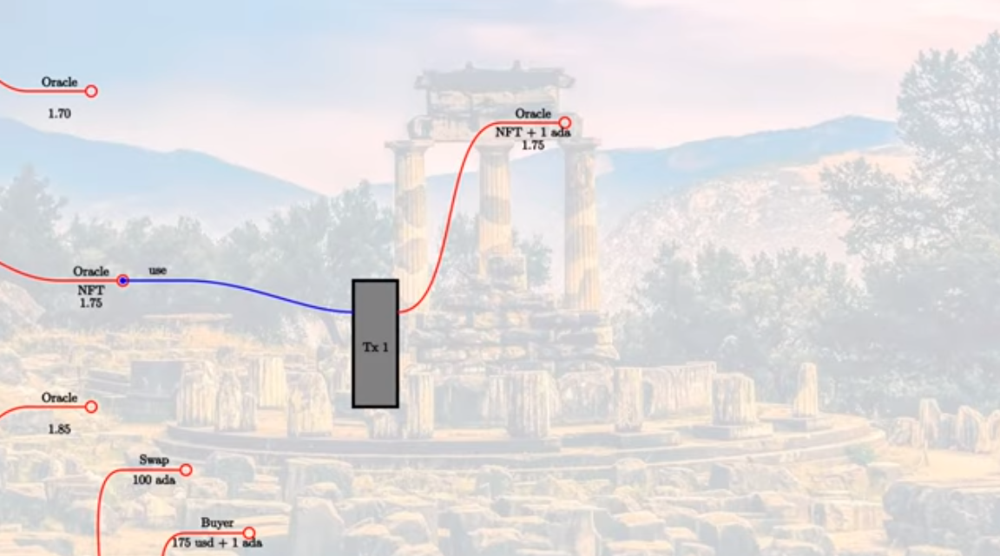
First of all, the swap validation logic will need access to the current oracle value, which means that the oracle UTxO must be an input to the transaction.
Then we have the oracle validation logic. In this case we want to use the oracle. So, let’s say we have a redeemer called use. Now, the oracle validator has to check several things.
- Is the NFT present in the consumed input?
- Is there an output from the transaction at the same address containing the same NFT?
- Is the value in the output UTxO the same as the input value?
- Is the fee present?
Now we can complete the transaction.
We consume two additional inputs - the fee paid by the buyer and the 100 ADA deposited by the seller. Then we have two additional outputs - the 175 USD to the seller, and the 100 ADA to the buyer. And for these new inputs and outputs, it is the responsibility of the swap validator to make sure that it is correct. Whereas, the oracle validator is only interested with making sure that everything concerning the oracle is correct.

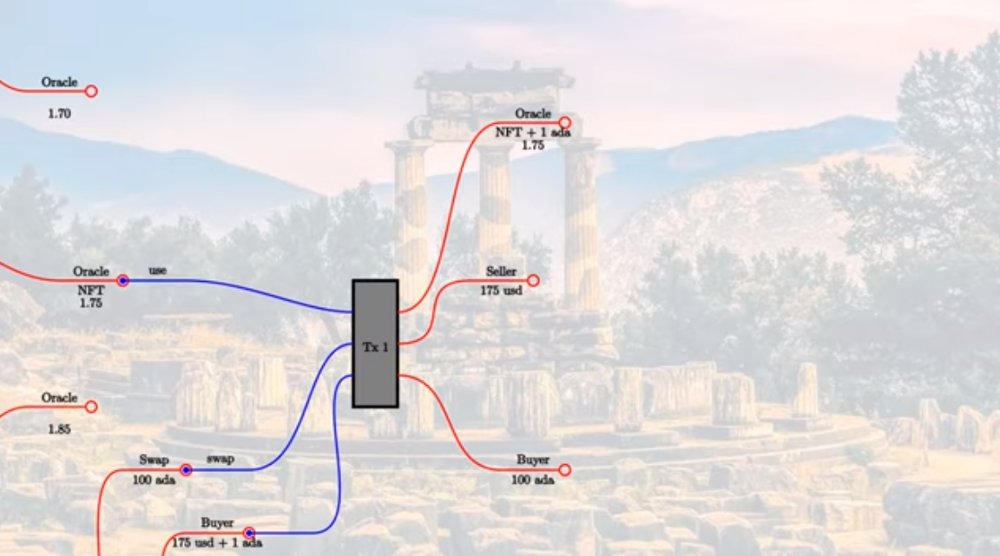
So let’s say the the value changes from 1.75 to 1.77.

We know that on a (E)UTxO blockchain, nothing ever changes, so you can’t change the datum of an existing UTxO. All you can do is consume UTxOs and produce new ones.

We would have a transaction that uses an update redeemer. The validation logic is somewhat different. It is the same as before in that the NFT needs to be present in the consumed oracle input, and also needs to be present in the new output. In addition to that, the transaction must be signed by the oracle provider. And, we can use this update transaction as an opportunity for the oracle provider to collect the fees.

We insist that the NFT be present in the output, but we don’t say anything about other values. All the fees that got there by other transactions using this oracle data can be collected during the update transaction.


### Summary
To sum up, we represent the oracle/data feed by a UTxO and identify the correct UTxO with an NFT. The UTxO sits at the script address of the oracle, and its datum field it carries the current value of the oracle data. The oracle value is the datum of the UTxO.
We support two operations.

One is use which uses the oracle in some arbitrary transaction.
- The use validator will make sure that
- the consumed oracle input carries the NFT,
- that there is an output that again carries the NFT,
- doesn't change the datum, and
- carries additional fees.

The second operation is **update** which can only be done by the oracle provider.
Other Oracles, like result of sports match, are single events in history
So not all Oracles need update functionality

An update transaction must:
- consume UTxO and provide new one which provides updated UTxO
- Plus pay fee to owner
- Must be signed by Oracle provider
- the oracle input must again carry the NFT,
- there must be an oracle output, also carrying the NFT.
- The datum can change, and
- the accumulated fees can be taken out.

## ORACLE CORE
### ONCHAIN

We see some common checks for use and update:
We check if NFT exists exactly once in UTxO input and in output which spents ORACLE NFT. It also checks if the NFT is present to the output only once.

Two extra checks: update - USE & UPDATE:

In both checks we check if operator has signed the transaction.
In use it confirms also that the fees has been paid by checking the outputs if they have the inputs plus the fees.


### OFFCHAIN

- #### Starting the oracle
- #### Updating the oracle
On-chain code that is not paired with some off-chain code. It is the responsibility of the person who wants to use the oracle to write the code to create the transaction with the redeemer.

### START ORACLE

Things to remember here:
- Params for Oracle, OracleParams
- No initial value, since creating NFT takes some slots
  - if we provided an initial value, it may be outdated by the time the NFT is minted.
- Mint NFT (only thing done in start)
  - Use forgeContract from Currency module
  
#### Check in REPL about forgeContract

```
Prelude Week06.Oracle.Core> :t Plutus.Contracts.Currency.forgeContract
```
What concerns the PubKeyHash represents the hash of the public key of the recipient of the NFT.
forgeContract can:
- generate multiple NFTs in one go
- create a currency symbol that can only be used one
- for the one currency symbol, you can mint various tokens in the same transaction, with various token names and in various quantities.
and finally we do
- Construction of Oracle Parameter Value

### UPDATE ORACLE
### The updateOracle function

Things to remember here:
- If no UTxO found
  - we want to create a value for the very fisrt time
- If UTxO exists
  - value exist and we wish to update it

### FindOracle function:
- If it FAILS, means that we have just created the oracles and haven't created yet a UTxO with the Oracle Value
- If it SUCCEEDS,  return a triple containing
  - the UTxO identifer (TxOutRef),
  - the UTxO itself, which contains all the data (TxOutTx) and
  - the oracle value

```
utxos <- Map.filter f <$> utxoAt (oracleAddress oracle)
```

The first thing we do is to get all the UTxOs sitting at this address. But only one of these will be the one we are looking for - the one that contains the NFT. We do this by using the Map.filter function which takes a function as a parameter which, **in this case, returns True for the UTxO where the NFT is present.**

### UpdateOracle function:
- Look for findOracle
- ### if it fails to find an oracle
  - Oracle started but no Initial Value
  - submit a transaction that produces the initial value for the oracle.
  - Wait confirmation
  - Write a log message
- ### If it succeeds
  - Value exists
  - Need a reference to the UTxOs parts
  - Datum will be updated, so we don’t care about it for the moment.
  - unspentOutputs: provide the lookup with one UTxO
  - mustSpendScriptOutput is the opposite of mustPayToTheScript. Creates an input to this script address. As parameters it takes the:
  - reference to the UTxO we want to consume,
  - the Redeemer which is Update and it is converted to the Plutus Data type.
  - transaction submitted using the @Oracling type
  - submitTxConstraintsWith: will send the fees to our own wallet
  - wait till transaction is confirmed
  - write log info

### runOracle function:

- OracleSchema: startOracle and updateOracle into one contract.
- Starts the oracle,
- Tell the oracle: call the helper function go. → is to block at the update endpoint.
- if an integer is provided as a new value then it calls updateOracle with the new value
- loops to allow others to update the oracle.

### SWAP VALIDATION
The purpose of this contract is for someone to be able to deposit ADA and exchange it for a token, in our case a token that we will call USDT for US Dollar Token.
The idea is that the price, the amount of USDT that will be required to be paid for the ADA, will be determined by the value of the oracle.

Now we will write **mkSwapValidator**.
This is a parameterized validator with two parameters.
- The first parameter is the oracle that we are using. To use this, we import the oracle module.
- the address of the oracle,  given the oracle, we would be able to compute the address from it

- For the datum, we use the public key hash of the seller.
- We don't use a redeemer, so we give it a type of Unit.

We recall from the diagram, the swap transaction should have three inputs and three outputs.

### Swap Transaction Inputs and Outputs
#### Inputs
- The oracle, to check the current exchange rate
- The swap UTxO that holds the lovelace
- The source of the buyer's funds
#### Outputs
- The oracle, which we don't need to look at in the swap validation
- The tokens for the seller
- The lovelace for the buyer


### Use cases:
- If nobody does swap
  - If we don't support this case, the ADA could be locked there forever, if nobody ever decides to make the swap.

This second case is the condition we check in the validator. If the seller themselves signs the transaction, there are no further constraints - we don't need to check the oracle or anything else - the seller can just get back their lovelace.The more interesting case is the second one, **where we check two conditions.**


#### Firstly, there must be two inputs  
the oracle and the swap UTxO. All additional inputs (the buyer's funds) must be public key inputs.
Secondly, we want to check that the seller gets paid. → Just check if tx is signed by seller, txSignedBy info pkh

### OracleInput:
- get the UTxO from the oracle.
- get list of all inputs, then it compares with the addr parameter.
- the list will be EMPTY or it will have the TxOut that matches the oracle UTxO.
- check if there is only one element in the list (NFT)
- if it EXISTS, returns the TxOut.


### OracleValue:
- Check the actual EXCHANGE RATE
- If it succeeds returns the value
### MinPrice:
- Find out how many lovelaces are locked in swap.
- CHECK IF INPUT, ASSIGN that number to lovelaceIn
- use the price helper function to determine the price in USD tokens.


### sellerPaid:
- Checks if seller is get paid

**Note**: We can use OracleAddress function inside the Plutus validator.


### offerSwap
This is for a seller who wants to offer a certain number of lovelace for exchange.
- Takes Oracle to use and lovelaces seller wants to add
- Pays amout of lovelaces to script (swap)

### findSwaps
- find all swaps that satisfy a given predicate
- takes an oracle plus a predicate based on public key hashes
- returns a list of triples of the UTxOs that satisfy the predicate.
- use the **mapMaybe and the function g** to filter the list of UTxOs.
- g function: takes a key value pair representing the UTxO and returns a Maybe triple containing the items from the pair alongside a PubKeyHash.
- **Function f** gets the public key hash from a UTxO, if it exists. After this, function g uses the guard function with the predicate function p that we passed in as an argument.

### retrieveSwaps
- retrieveSwaps contract is for the seller if they want to change their mind and get their Ada back
- use the findSwaps function
- use findSwaps  with (== pkh) as the predicate, meaning that we want only those UTxOs sitting at the swap address that belong to the operator.
  - are they any UTxOs?
    - NO. Then there is nothing to do
    - YES. construct a transaction that retrieves all of them.
      - create a list of mustSpendScriptOutput constraints.
      - extracting a list of orefs from the xs list and using it to construct a constraint for each of them, using Unit as the Redeemer type.
      - The function mconcat applies the Semigroup operator <> throughout the list in order to combine them.
      - We have the list of UTxOs in xs and we use list comprehension to turn this list into a list of pairs, and we then use Map.fromList to turn those pairs into a map, to which we then apply the unspentOutputs constraint.

### useSwap:
#### Where the oracle actually is used.
- ownFunds:
  - add up all the money in our own wallet and returns a Value.
  - find out how many USD Tokens we have.
- findOreacle: it finds us the oracle UTxO that contains the oracle value. (Core.hs)
    - NOT FOUND. → log message
    - FOUND. →
      - log message with current exchange rate.
      - check our own public key
      - check for all available swaps where we are not the owner
        - f functions is defined in predicate
        - The function determines if there is a swap that is cheaper to or equal to the amount parameter.
        - construct a transaction. (let v)
        - create a Value representing the USD Tokens that we need to pay. (p)
      - #### CONSTRAINTS:
        - First constraint is that we must consume the oracle as an input. And here we see the first use of the Use redeemer.
        - Second constraint is to consume the swap input, which just uses a Unit redeeemer.
        - Third constraint is to pay the oracle.
        - Final constraint is that we must pay the seller of the lovelace
      - #### LOOKUPS:
        - we must provide the two UTxOs that we want to consume.
      - Submit transaction
      - Wait for confirmation
      - Log message

### Contract bundle
A Bundle that contains ALL OF THEM (Offer, Retrieve, Use, Funds)

The swap function recursively calls itself, offering again and again the same choice of endpoints.
- For offer, we block until we are provided with an amt and then we call the offerSwap contract.
- It is the same for the retrieve and use endpoints, except that they require no parameters.
- **Funds**: It gives us the Value that we own. We then tell this value as a way of reporting to the outside world how much we have.
- The **h** in each of the endpoints is an error handler. Each of the endpoints is wrapped inside the error handler, which just logs the error, but does not halt execution.

### FUNDS MODULE
- module that provides two contracts.
- **ownFunds** is tasked with summing up all the Value in our own UTxOs.
  - Look up for the public key
  - getting all the UTxOs at that public key address
  - UTxOs are a map from UTxO references to UTxOs
- **ownFunds’**:  
  - performs a monadic bind to the composite function tell . Last . Just which tells the value,
  - then it tells the value
  - it waits for a slot
  - calls itself
  - every block writes the value into the log

### TESTING

Test in Repl:
```
Prelude Week06.Oracle.Core> import Week06.Oracle.Test
Prelude Week06.Oracle.Test Week06.Oracle.Core> test
```


We see at slot 9 the swap happened:
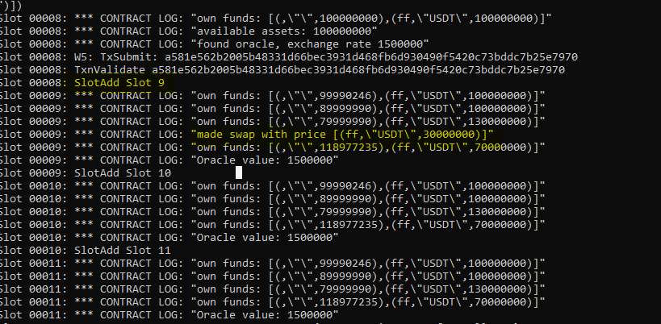


Slot 11 we see an update endopoint and that update happened in Slot 12:
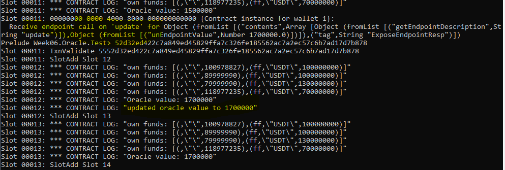
an extra use request at slot 14, which arrives at slot 15 and the SWAP happens:
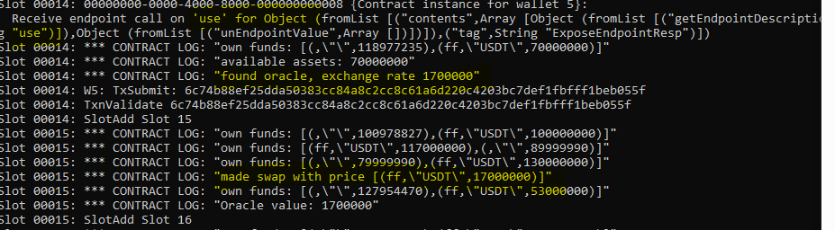


At the end we see the Final Balances of the wallets:

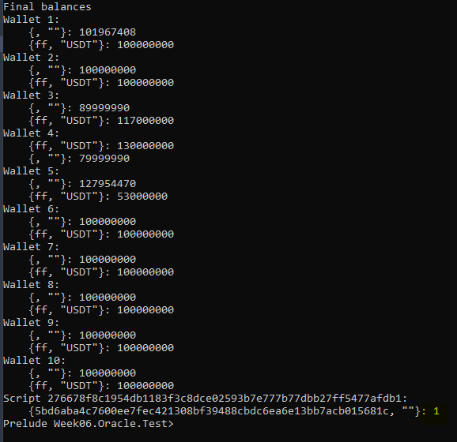
- **Wallet 2** still has all its funds. All Wallet 2 has done is the oracle checking, which doesn’t cost anything, as it is purely an off-chain matter.
- **Wallet 1** paid some transaction fees but ends up with roughly 2 Ada more than it started with. This is because it collected the 2 Ada in fees for the use of the oracle.
- **Wallets 3** and 4 both made offers, and their balances reflect the exchange rates at which their offers were accepted.
- **Wallet 5** was the one accepting the offers, and so has the additional Ada, but a reduced USD Token balance. Note that Wallet 5 has also had some fees deducted from its Ada balance.
And finally, as well as the wallets, we see that the oracle is still going, and still owns the NFT. Note that, in this log, we don’t see the datum value.

## PAB - PLUTUS APPLICATION BACKEND
The component which manages Plutus Applications that run on users’ machines. It handles:
1. Interactions with the node
2. Interactions with the wallet backend
3. Interactions with the wallet frontend
4. State management
5. Tracking historical chain information

### ORACLE PAB

- Start simulated wallet
- Initializes all contracts
- Starts web server which allows to interact with contracts


The Plutus Application Backend is the client-side runtime for Plutus apps that are built with the Plutus Platform. It is the PAB’s task to deal with requests from running Contract instances, to forward user input to them, and to notify them of ledger state change events.
The Plutus Application Backend (PAB), which allows us to take all the stuff we have done and turn it into an executable that runs the contracts.


Init won’t have any schema, so it just has BlockChainActions. Oracle uses the OracleSchema and Swap uses the SwapSchema. No surprise there.
Init will run the initContract, which we will see in a moment.
Oracle will run the runOracle contract with oracleParams which takes the currency symbol of the USD Token and defines example oracle params.
Swap will run our swap contract with an oracle value.
The initContract function mints USD Tokens and distributes them to the wallets, then it tells the currency symbol for the USD Token.
Then we have the entry point of executable which is the main function which uses the Simulator Monad.
- You can start contracts on wallets,
- you can inspect the state using the log,
- you can call endpoints, and so on.

If you are curious about the API provided by the PAB, you can check that in the plutus-pab package, in the module Plutus.PAB.Webserver.API. This makes use of the popular Haskell library Servant to write type safe web applications, but it should be readable more or less without knowledge of the Servant library. For example, you can see the /api/new/contract/activate endpoint declared to which you can POST a ContractActivationArgs as its body and returns a ContractInstanceId.
There is also a web socket API,

Try the executable.
```
cabal run oracle-pab
```

We get log output similar to what we see with EmulatorTrace, but this is now a live server.
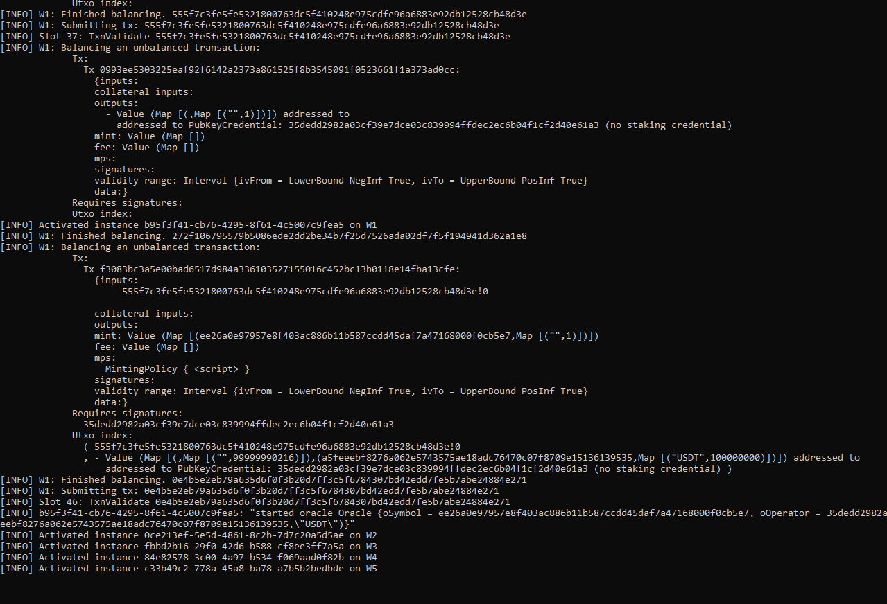

We can see, for example, where we can find instance IDs of contracts if we want to interact with them via the API.
```
[INFO] Activated instance 0ce213ef-5e5d-4861-8c2b-7d7c20a5d5ae on W2
```
If we now stop the server and look in the directory, we will see the files where we stored the instance IDs.

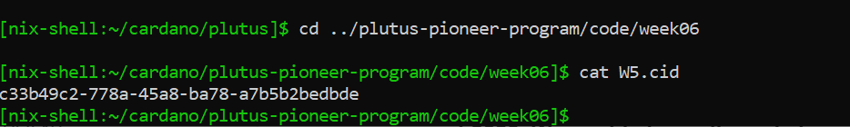

With this information - either obtained from the web server log, or from the files we have created, we could use any HTTP tool such as Curl or Postman to interact with the contracts when the web server is running. By default it runs on port 8080. We could also write code in any programming language we like to interact with the web server using the HTTP endpoints.
We will now briefly look at the oracle-client and the swap-client. We won’t go into too much detail because we are not so interested in how to write a front end here.

## ORACLE CLIENT

- Run by Oracle provider
- Runs Oracle contract
- Fetches exchange rates from internet and feeds into Oracle


We have to make sure that the PAB is running
```
cabal run oracle-pab
```
Then, in another terminal

```
cabal run oracle-client
```

where We can see the exchange rate that it has obtained from CoinMarketCap, and its request to update the oracle.

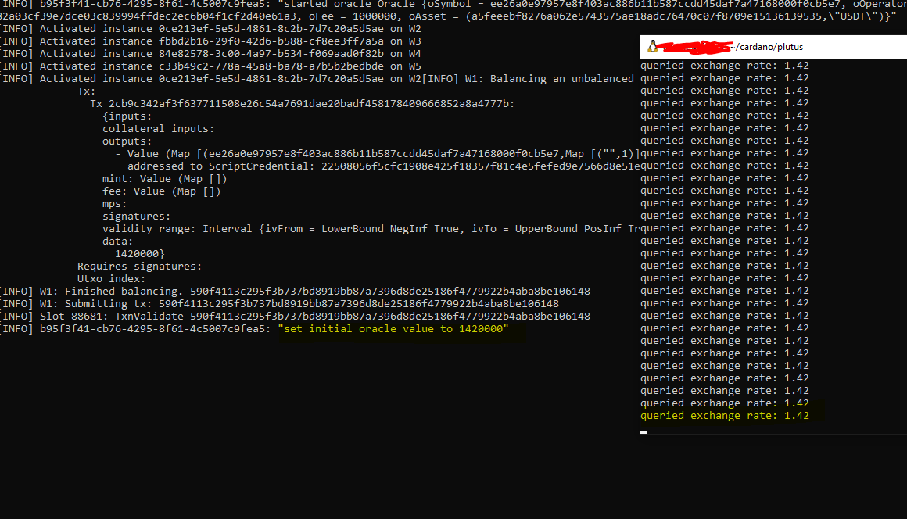


## SWAP CLIENT

- Run by clients which want to use swap contract
- Offers via CLI different commands (offer, retrieve, use, funds)
- Getting funds
  - POST /api/new/contract/instance/$cid/endpint/funds
    - Extract from state the current funds
    - tells funds
Run for wallet 2: 
      ```
      cabal run swap-client -- 2
      ```

The idea is to take a command from the console and the call the appropriate endpoint. The endpoint calling uses the same method for each endpoint, creating an HTTP call in the same way that we did for the oracle client.

Let’s run the swap client. We will leave the web server and the oracle client running.

When using cabal, we pass parameters in following a –. For the swap client we pass the wallet number in as a parameter.

We will launch the swap client for wallets 2 and 3, each in a separate window, and query their respective funds.

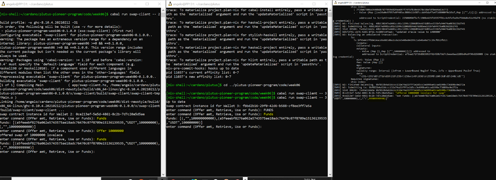
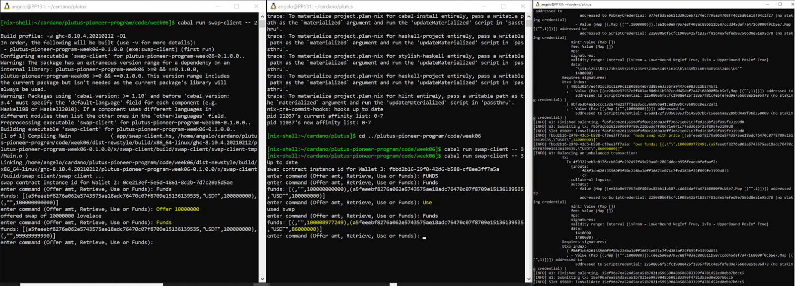

Check the 2 wallet’s 2 && 3 Funds:

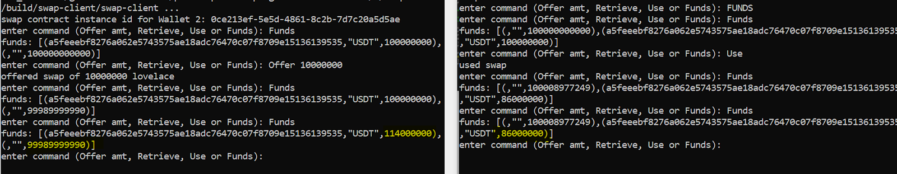

We see that wallet 2 has lost some Ada, but gained some USD Tokens. The swap is complete, using the exchange rate as it is live, right now, which was injected into the mock blockchain via the oracle.

#### So now we have seen an end-to-end example of a Plutus dApp.
- It has a front end, it talks to the outside world, goes on the internet, gets information and interacts with Plutus smart contracts.
- The smart contracts submit transactions to the blockchain where the validation logic kicks in and makes sure that everything follows the business rules.

In this example, as we have no real blockchain to play with, all wallets use the same PAB server, which, of course, in real life would be silly. Obviously, different wallets will have different instances of PAB running.

But, apart from that, it is almost exactly, end-to-end, how such a system would work.


## **Social Media Links Links/ More information:**

**Linkedin** :
[Kappos Angelos](https://www.linkedin.com/in/angelos-dionysios-kappos-4b668140/)

**Twitter accounts:**
- [angelokappos](https://twitter.com/angelokappos)
- [sapiopool](https://twitter.com/sapiopool)

**Who is SapioPool Cardano Community** : [Sapiopool Website](https://sapiopool.com/)


**Participate/collaborate in Sapiopool Greek Community *Discord* channel here** :
- [Discord Sapiopool](https://discord.com/invite/HRK9gGE9ax)

**Youtube:**
- [Sapiopool](https://www.youtube.com/channel/UCcPH2RMsszRGJ2awvLdMKzQ)
- [Marlowe](https://www.youtube.com/user/simonjohnthompson/videos)
- [Haskell](https://www.youtube.com/playlist?list=PLe7Ei6viL6jGp1Rfu0dil1JH1SHk9bgDV)