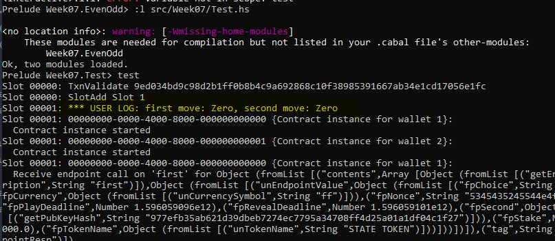
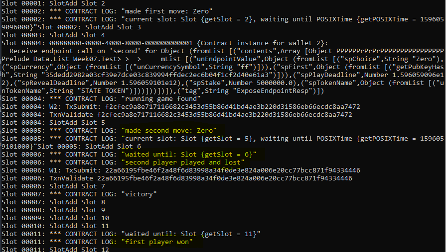
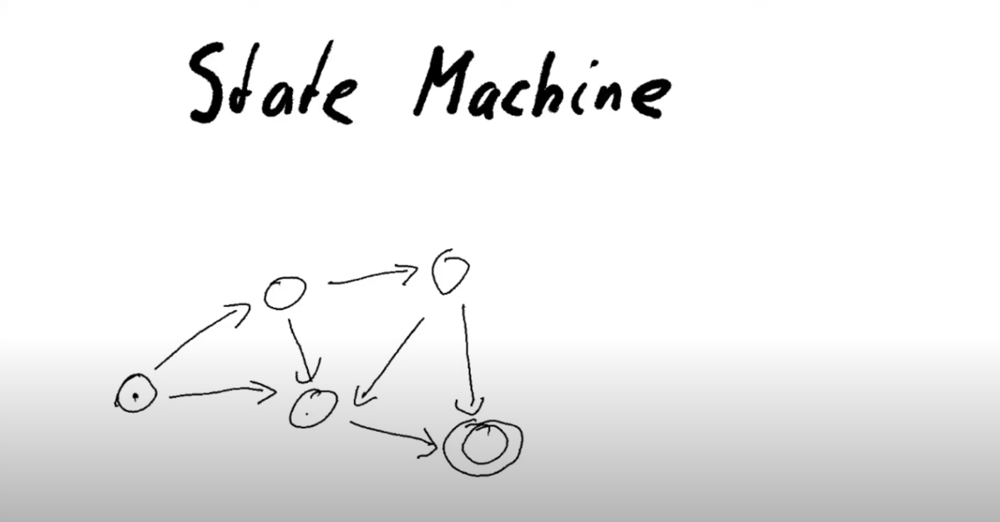
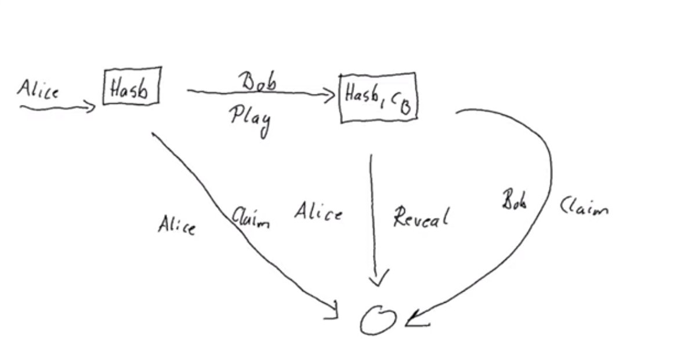

# PLUTUS PIONEER PROGRAM COHORT 2

### Documentation Week 7

### Creator: [Kappos Angelos](https://www.linkedin.com/in/angelos-dionysios-kappos-4b668140/)

### Credits to: [Sapiopool Cardano Community](https://sapiopool.com/)

### Contents
### Overview
- #### STATE MACHINES
- #### Implementation (without using State Machines) -  Week07.EvenOdd
- #### Testing Contract without state Machines
- #### Implementation (with State Machine) State Machine - Week07.StateMachine
- #### Testing contract with State Machines


State machines can be very useful for writing shorter and more concise contracts, both on-chain and off-chain.
There is higher level support for state machines in the Plutus libraries that builds on top of the lower level mechanisms. Many common function with the appropriate definition, which are used for State Machine, can be found here
[State Machine Plutus Contracts](https://playground.plutus.iohkdev.io/tutorial/haddock/plutus-contract/html/Language-Plutus-Contract-StateMachine.html)

Implementation (without using State Machines) -  Week07.EvenOdd


### On chain code

- #### Validator parameter Game and GameChoice s
    - UTxO with token used to track state of game

- #### State of Game
- ####  Redeemer
    - Play: where the second player moves
    - Reveal:  is for the case where the fisrts player has won - how they will reveal their nonce which is the ByteString
    - ClaimFirst: when 1st player claims back the stake when the 2nd doesn't move by the gPlayDeadline
    - ClaimSecond: when the 1st player doesn't reveal by the gRevealDeadline

- #### gameDatum
    - gameDatum behaves similarly with oracleValue
        - oracleValue helper function -->
            - takes an output transaction and a function which looks up the datum, and then
            - returns an Integer.

- #### Validator
    - ####  CORE BUSINESS LOGIC where we have
        - game
        - bsZero' bsOne': Used as somewhat of nuisance. USe them as string literals to get ByteStrings (represent 0 adn 1 respectively)
        - dat: Datum
        - red: Redeemer
        - ctx: Context
    - #### Helper Functions on  chain
        - info
        - ownInput : should never fail - helps to validate the UTxO
        - ownOutput
        - outputDatum  makes use of the GameDatum type
        - checkNonce: is for the case where the first player as won and wants to prove it by revealing their nonce.
            - to check the hash of nonce weth GameChoicem we use a function to convert GameChoice to a ByteString
            -  cFirst and cSecond
                - Difference of them, one uis a GameChoice and second is ByteString
            - nftToFirst: gme is over. NFT return back to 1st player
        - Conditions that cover all the cases that will be handled without state machines
            - pattern match on different states
                - 2nd player is moving (has not moved yet)
                - 1st player has won, reveals his nonce in order to claim
                - 2nd player has not moved before `gPlayDeadline`,
                    - so 1st can claim back money
                - Both have moved, 1st has lost or not revealed in time, so 2nd can claim stake
                - rest cases will fail

    #### Conditions
    - pattern match on different states
    - 2nd player is moving (has not moved yet)
    - 1st player has won, reveals his nonce in order to claim
    - 2nd player has not moved before `gPlayDeadline`, so 1st can claim back money
    - Both have moved, 1st has lost, so 2nd can claim stake


### Off chain Code

- #### Finds correct UTxO with token and game state
    - findGameOutput: Contract: used to find the UTxO with the NFT (returns Maybe || anything)
- #### Contract for first player
    - Params for 1st player
    - Contract - **firstGame**
        - get the public key hash
        - populate the fields of the game
        - set value v where stake + NFT both go to the UTxO
        - calculate the hash that we need to send as our disguised move -- c
        - Submit transaction -- ledgerTx
        - wait deadline slot -- ```waitUntilTimeHasPassed $ fpPlayDeadline fp```

		- #### Check conditions of contract
			- #### UTXO FOUND
				- 2nd player hasn't moved, 1st player reclaimed stake
				- 2nd player moved, and lost
				- 2nd player played and won
			- #### UTXO NOT FOUND
	- #### Contract for 2nd player - SecondGame
		- NO NEED of the second player’s public key hash
		- NO NEED of nonce required
		- Check conditions of contract
			- try to find the UTXO  that contains the NFT  (case m of:) 
			- #### NFT NOT FOUND THEN: 
				- log message no running game found.
			- #### NFT FOUND THEN:
				- assign NFT to Token
				- calculate the value that we must put in the new output -- check CONSTRAINTS
				- consume existing UTXO and 
				- create a new one at the same address
				- keep NFT in there
				- submit transaction
				- confirmation of the transaction
				- log message
				- wait deadline
			- #### Then, find UTXO which could be different one. (case m' of: )
				- #### UTXO NOT FOUND
					- 1st player revealed and won.
				- #### UTXO FOUND
					- Must spend the UTXO that we have found after the deadline has passed
					- Must back hand the NFT to the first player -- check constraints
					- submit transaction
					- confirmation of the transaction
					- log message --> 2nd player won.


### Testing in Repl


The first scenario is that both play zero, so the first wallet should win.

The first wallet creates the initial UTxO with its stake, and logs a message that it made the move.


While the first wallet is waiting, the second wallet kicks in and finds the UTxO, sees that it can make a move, and does so.


The first player realizes that they have won, and so must reveal. And we see in the final balances that Wallet 1 does indeed have the NFT back and it also has almost 5 ada more than it started with. The difference is, of course, due to transaction fees. And the second wallet has a little more than 5 ada less.


##State Machine


- Definition of State Machine 

A state machine is a behavior model. It consists of a finite number of states and is therefore also called finite-state machine (FSM). Based on the current state and a given input the machine performs state transitions and produces outputs. Some states can be final states, from which there can be no further transitions.

If we look again at how our games works, then we can consider it to be a state machine.

From the initial state, there are two possible transitions. One where Bob plays, and the other where Bob does not player and Alice can reclaim.

In the diagram, all the nodes correspond to states, and all the arrows correspond to transitions.

In the blockchain,
- the **state machine will be represented by a UTxO** sitting at the state machine address.
- #### The state of the machine will be the datum of that UTxO.
- #### A transition is a transaction
    - ##### that consumes the current state,
    - **using a redeemer** that characterizes the transition, and then
    - #### produces a new UTxO at the same address, where
    - the **datum** now **reflects the new state.**

By using State Machine approach, **code will be much shorter.**
To write your contract as a state machine **you need Two types**
- state and input for the state and
- inputs of the machine .
    - s = state, Datum
    - i = input, Redeemer

- ### Implementation of the game

    - Add a Final state to GameDatum
    - Now: transition functions derived from former validator function
        - No more check for token required, already checked within StateMachine
        - Uses the mustBeSignedBy, ... contrains already used in off-chain code
        - Check for nonce can not be expressed as a constraint (second case):
            - Added to smCheck function, function check
    - Defining the StateMachine 
      - ```gameStateMachine :: Game -> ByteString -> ByteString -> StateMachine GameDatum GameRedeemer```
      - Requires a function for final states, final
```
gameStateMachine game bsZero' bsOne' = StateMachine
    { smTransition  = transition game
    , smFinal       = final
    , smCheck       = check bsZero' bsOne'
    , smThreadToken = Just $ gToken game
    }
```
	 
- Create validator from it with mkValidator $ gameStateMachine ... 

```
mkGameValidator :: Game -> ByteString -> ByteString -> GameDatum -> GameRedeemer -> ScriptContext -> Bool
mkGameValidator game bsZero' bsOne' = mkValidator $ gameStateMachine game bsZero' bsOne' 
```
      

 - #### Create a  [StateMachineClient](https://playground.plutus.iohkdev.io/tutorial/haddock/plutus-contract/html/Language-Plutus-Contract-StateMachine.html#v:mkStateMachineClient) 
   - #### Interact from Wallet with state machine (Contract monad)
	- #### Takes a StateMachineInstance [StateMachineClient ]
		- **scInstance** :: StateMachineInstance s i : The instance of the state machine, defining the machine's transitions, its final states and its check function.
	- #### StateMachine chooser [mkStateMachineClient]
		- **scChooser**  :: [OnChainState s i] -> Either SMContractError (OnChainState s i): A function that chooses the relevant on-chain state, given a list of all potential on-chain states found at the contract address. Is the mechanism , from the off-chain code, for finding the UTxO that represents our state machine. In general there will be a list of UTxOs at the address of the state machine, and scChooser is a function that specifies which to pick.
			  	  
	- #### firstGame version
		- #### Create a client with gameClient
		- **runInitialise**: Start state machine with (with client, datum and value) && creates a UTxO at the state machine address.
			-  takes the client as its first argument and then it needs the initial datum and the initial value for the UTxO sitting at that address.
			- put the NFT there as well.
		- Wait until play the **deadline**.
		- #### Get the current UTxO by using getOnChainState: It returns (a Just [OnchainState](https://playground.plutus.iohkdev.io/tutorial/haddock/plutus-contract/html/Language-Plutus-Contract-StateMachine.html#t:OnChainState)) 
			- #### if it finds the state machine 
				- returns OnChainState Similar to what utxoMap returns, but typed
				- Also provides Datum, i.e. no manual searching and checking
			- #### OR it DOESN'T finds the state machine then returns
				- Nothing 
			- Check the TypedScriptTxOut parameter, which we assign to o, which is a parameter to lookup the datum tyTxOutData
		- In state pattern match (Check what 1st && 2nd player has done):
			- Use **runStep** to move state machine forward, just Redeemer required
				- Takes StateMachineClient, input (Redeemer)
				- **Submits transaction**  that will transition the state machine.
					- No lookups, less helper functions, ...
					- Reduces code heavily
					- No duplicated logic anymore
				- #### Cases of firstGame:
					- They haven't moved --> 1st player reclaims stake
					- 1st player revealed and won
					- All other cases 2nd player wins
		- #### secondGame (similar to firstGame)
			- Check additional cases:
				- Check if game hasn't played yet
					- Case of NO STATE --> 1st player won.
					- Case of STATE --> 2nd player won if there is a state.

- #### Notes:
    - On-chain checks if transaction is valid
    - Off-chain constructs transaction
    - So different purposes
    - But by defining via constraints, used for both
    - In State Machine approach:
        - No need to replicate logic anymore.
        - By using State Machine, we define logic that can be used to On chain and Off Chain.

### Testing State Machine Implementation

### Results will be similar
Before run the test import the TestStateMachine.hs module
```
Prelude Week07.StateMachine Week07.EvenOdd> :l src/Week07/TestStateMachine.hs
Prelude Week07.StateMachine Week07.TestStateMachine> test
```

## **Social Media Links Links/ More information:**

**Linkedin** :
[Kappos Angelos](https://www.linkedin.com/in/angelos-dionysios-kappos-4b668140/)

**Twitter accounts:**
- [angelokappos](https://twitter.com/angelokappos)
- [sapiopool](https://twitter.com/sapiopool)

**Who is SapioPool Cardano Community** : [Sapiopool Website](https://sapiopool.com/)


**Participate/collaborate in Sapiopool Greek Community *Discord* channel here** :
- [Discord Sapiopool](https://discord.com/invite/HRK9gGE9ax)

**Youtube:**
- [Sapiopool](https://www.youtube.com/channel/UCcPH2RMsszRGJ2awvLdMKzQ)
- [Marlowe](https://www.youtube.com/user/simonjohnthompson/videos)
- [Haskell](https://www.youtube.com/playlist?list=PLe7Ei6viL6jGp1Rfu0dil1JH1SHk9bgDV)